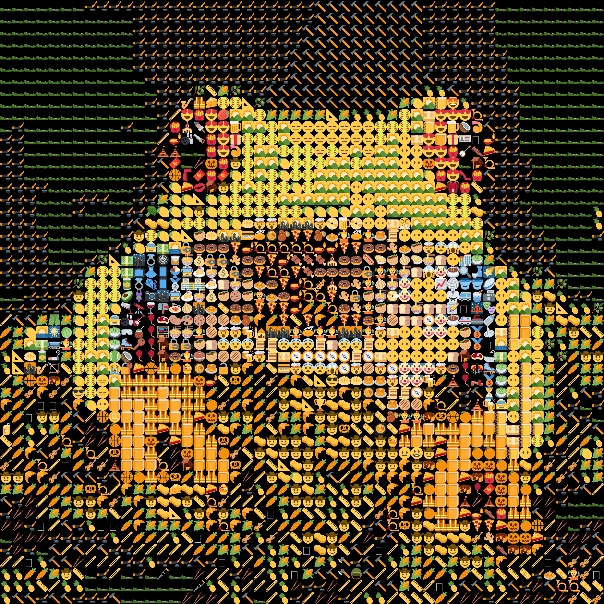

# Рисование картинок из смайликов

Способ построения картинки из смайликов:
1. Составляется множество смайликов, из которых будет рисоваться картинка. Например, {'😀', '👍', '❤️', '🇷🇺'}.
2. Каждый смайлик из множества изображается в квадрате NxN пикселей, а затем из каждого такого изображения извлекается средний цвет по всем пикселям.
3. Составляется словарь, где каждому смайлику соответствует рассчитанный для него средний цвет. Например, смайлику '😀' соответствует цвет RGB(178, 142, 55).
4. Выбирается изображение, которое необходимо нарисовать с помощью смайликов.
5. Выбирается разрешение будущей картинки (сколько смайликов в ширину она будет), и исходная картинка сжимается под соответствующие размеры.
6. Для каждого пикселя сжатой картинки подбирается наиболее подходящий смайлик из составленного ранее словаря. Для этого цвет пикселя картинки сравнивается со средними цветами смайликов из словаря, и выбирается смайлик с наиболее близким цветом. Близость цветов определяется евклидовым расстоянием между ними в трехмерном пространстве RGB.
7. Таким образом, каждому пикселю сжатой картинки сопоставляется наиболее близкий к нему по цвету смайлик.
8. Итоговая картинка сохраняется как в текстовом формате (в виде набора смайликов), так и в формате PNG.

> Разумеется, все параметры можно менять под себя, например, размер квадрата для поиска среднего цвета смайлика, цвет фона для отрисовки, разрешение итоговой картинки и многое другое.

Используемые сторонние библиотеки:
- [NumPy](https://numpy.org/) - для работы с массивами;
- [Pillow](https://pillow.readthedocs.io/en/stable/) - для работы с изображениями;
- [Pilmoji](https://github.com/jay3332/pilmoji) - для рисования смайликов в Pillow.

# Структура репозитория

**Ноутбуки:**
- `drawing.ipynb` - основной ноутбук, в котором можно быстро нарисовать любую картинку из любых смайликов. Для удобства использования в нем практически ничего нет, а весь функционал находится в файле `utils.py`;
- `dict_generation.ipynb` - ноутбук с подробным описанием процесса создания словарей из смайликов.

**Папки:**
- `input/` - папка с исходными изображениями, с которыми работают ноутбуки;
- `output/` - папка с выходными картинками из смайликов в *.txt* и *.png* форматах;
- `emoji_dicts/` - папка с созданными словарями смайликов;
- `emoji_sources/` - папка со списками смайликов (которые используются для создания словарей);
- `fonts/` - папка для шрифта *arial.ttf*, который используется для отрисовки смайликов.

# Пример

